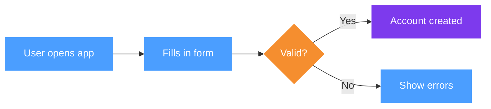

# FigJam Diagram Generator

You have two tools for creating FigJam diagrams. Choose the right one upfront — it determines the
entire approach.

## Tool selection

| Signal in the request | Use |
|---|---|
| "add to this board / this FigJam", provides a Figma URL | **use_figma** |
| Wants sections with ADVANTAGES/SHORTCOMINGS, pros/cons | **use_figma** |
| Wants coloured flow (blue steps, purple system states) | **use_figma** |
| Comparing multiple options / scenarios side by side | **use_figma** |
| "quick flowchart", "simple diagram", no existing board | **generate_diagram** |
| Sequence diagram, state machine, Gantt chart | **generate_diagram** |
| Standard process flow, decision tree, no style requirements | **generate_diagram** |

When in doubt and no existing board is referenced → ask. If a Figma/FigJam URL is present → **use_figma**.

---

## MODE A — generate_diagram (Mermaid)

Use `mcp__de696620-23eb-4e19-8d09-33aa6b46d45a__generate_diagram`.

**Supported types:** `flowchart`, `graph`, `sequenceDiagram`, `stateDiagram-v2`, `gantt`

**Mermaid rules enforced by the tool:**
- Direction: `LR` for flows (left-to-right) unless vertical makes more sense
- All node labels and edge labels **must** be in quotes: `["Text"]`, `-->|"Edge"|`
- No emojis, no `\n` for newlines inside labels
- Color styling only for flowchart/graph (not sequence/gantt), use sparingly
- No `end` as a className

**Color classes to apply when styling is wanted:**
```
classDef action fill:#4B9EFF,color:#fff,stroke:none
classDef system fill:#7D3AED,color:#fff,stroke:none
classDef decision fill:#F58E2F,color:#fff,stroke:none
classDef success fill:#26BA7A,color:#fff,stroke:none
```

**Example — styled process flow:**


Keep Mermaid diagrams **simple by default**. Add detail only if explicitly asked.

---

## MODE B — use_figma (Plugin API)

Use `mcp__de696620-23eb-4e19-8d09-33aa6b46d45a__use_figma` with `fileKey` extracted from the
FigJam URL.

**URL patterns:**
- FigJam board: `https://www.figma.com/board/FILEKEY/...` → fileKey is `FILEKEY`
- Figma design: `https://www.figma.com/design/FILEKEY/...` → fileKey is `FILEKEY`

### ⚠ Critical FigJam Plugin API constraints

These functions **DO NOT EXIST** in FigJam. Calling them causes `TypeError: not a function` with no
line number — the hardest bug to diagnose:

```
❌ figma.createText()
❌ figma.createRectangle()
❌ figma.createEllipse()
❌ figma.createFrame()
❌ node.resizeWithoutConstraints()   ← use node.resize(w, h) instead
```

What you CAN use:

```
✅ figma.createSection()
✅ figma.createShapeWithText()       ← for BOTH coloured boxes AND plain text
✅ figma.createConnector()
✅ figma.createSticky()
✅ node.resize(w, h)
✅ figma.loadFontAsync({ family, style })
```

**ShapeWithText is universal.** Use it for:
- Coloured step boxes (SQUARE shape, solid fill)
- System state hexagons (HEXAGON shape, solid fill)
- Text annotations (SQUARE shape, empty fill + empty strokes = invisible background)
- Actor icons (ELLIPSE shape for head, SQUARE for body)

### Append before positioning

Always `parent.appendChild(node)` BEFORE setting `node.x` and `node.y`. Setting coordinates
before appending can silently fail or produce wrong positions.

```javascript
parent.appendChild(shape);
shape.x = rx;
shape.y = ry;
```

### Connector order

Append connector to section first, THEN set endpoints:
```javascript
const c = figma.createConnector();
parent.appendChild(c);
c.connectorStart = { endpointNodeId: a.id, magnet: "AUTO" };
c.connectorEnd   = { endpointNodeId: b.id, magnet: "AUTO" };
c.connectorEndStrokeCap   = "ARROW_LINES";
c.connectorStartStrokeCap = "NONE";
```

---

### Native FigJam Table

`figma.createTable(rows, cols)` creates a real FigJam table — confirmed working.

**Fixed cell dimensions (cannot be changed):**
- Each cell: **192px wide × 64px tall**
- Total table size: `192 * cols` × `64 * rows` — no resize possible

**⚠ TableNode has NO `resize()` method.** Calling `table.resize(...)` causes `TypeError: not a function`. Do not attempt to resize tables.

**Usage pattern:**
```javascript
// Load Inter Medium (default table font) BEFORE setting any cell text
await figma.loadFontAsync({ family: "Inter", style: "Medium" });
await figma.loadFontAsync({ family: "Inter", style: "Bold" });   // for headers

const t = figma.createTable(rows, cols);
parent.appendChild(t);
t.x = rx;
t.y = ry;

for (let r = 0; r < rows; r++) {
  for (let c = 0; c < cols; c++) {
    const cell = t.cellAt(r, c);
    await figma.loadFontAsync(cell.text.fontName); // ensure font loaded
    cell.text.characters = "content";
    if (r === 0) {
      // Make header row bold
      cell.text.fontName = { family: "Inter", style: "Bold" };
    }
  }
}
```

**Cell text length rule:** keep all cell text ≤ 22 characters. Longer text wraps inside the 192px cell, making the row taller than 64px. Fixed-height content placed below the table then overlaps.

**Calculating table dimensions before placing follow-on content:**
```javascript
const TABLE_COL_W = 192;
const TABLE_ROW_H = 64;
const tableWidth  = cols * TABLE_COL_W;    // e.g. 3 cols → 576px
const tableHeight = rows * TABLE_ROW_H;    // e.g. 5 rows → 320px
const nextY = tableY + tableHeight + padding;
```

---

### Verified helper library

Copy this block verbatim at the top of every `use_figma` call. It has been tested and confirmed
working in FigJam. Do not modify function signatures.

```javascript
// ── FONT LOADING (required before any text) ──────────────────────────────
await Promise.all([
  figma.loadFontAsync({ family: "Inter", style: "Regular" }),
  figma.loadFontAsync({ family: "Inter", style: "Bold" }),
]);

// ── COLOUR PALETTE ───────────────────────────────────────────────────────
const C = {
  blue:   { r: 0.29, g: 0.62, b: 1.00 },  // user / admin actions
  purple: { r: 0.49, g: 0.23, b: 0.93 },  // system state changes
  orange: { r: 0.96, g: 0.55, b: 0.18 },  // decisions / warnings
  green:  { r: 0.15, g: 0.73, b: 0.48 },  // success / end states
  gray:   { r: 0.60, g: 0.60, b: 0.65 },  // neutral / actor
  ink:    { r: 0.10, g: 0.10, b: 0.15 },  // body text
  white:  { r: 1.00, g: 1.00, b: 1.00 },
};

// ── SECTION ──────────────────────────────────────────────────────────────
// The section IS the background — set fills on the section, not via a child shape.
//
// ⚠ CRITICAL ORDER: set fills AFTER adding all children AND after adding a spacer anchor.
//   FigJam sections do NOT expand programmatically during script execution.
//   Even when fills are set "last", the section's reported bounding box is the
//   pre-script size — so the fill only covers a portion of the visible content.
//
// ✅ CORRECT PATTERN — use an invisible spacer anchor:
//   1. Add all content (header, tables, boxes, etc.)
//   2. Find maxX and maxY across all children
//   3. Append a 1×1 invisible spacer at (maxX + PAD, maxY + PAD)
//   4. THEN set s.fills = [{ type: "SOLID", color: C.white }]
//   The spacer forces the section to include that point in its bounding box,
//   so the white fill covers the full content area + padding.
//
// ⚠ SectionNode does NOT have resize() — calling it causes "TypeError: not a function".
// ⚠ DO NOT add a white shape as the first child to fake a background — anti-pattern.
//
// Pattern:
//   const s = mkSection("Name", x, y);        // create, no fills yet
//   // ... add all content ...
//   mkSectionAnchor(s, 80, 80);               // anchor fills, add padding
//   s.fills = [{ type: "SOLID", color: C.white }];  // set LAST
function mkSection(name, x, y) {
  const s = figma.createSection();
  s.name = name; s.x = x; s.y = y;
  // DO NOT set fills here — add content, call mkSectionAnchor, then set fills
  return s;
}

// ── SECTION ANCHOR (invisible spacer to force section bounding box) ───────
// Call AFTER adding all content, BEFORE setting s.fills.
// padX / padY: breathing room beyond the last child element.
function mkSectionAnchor(sec, padX, padY) {
  padX = padX || 80; padY = padY || 80;
  let maxX = 200, maxY = 200;
  for (const child of sec.children) {
    if (child.name === "__spacer__") continue;
    const r = child.x + child.width;
    const b = child.y + child.height;
    if (r > maxX) maxX = r;
    if (b > maxY) maxY = b;
  }
  const spacer = figma.createShapeWithText();
  spacer.name = "__spacer__";
  spacer.shapeType = "SQUARE";
  spacer.resize(1, 1);
  spacer.fills = []; spacer.strokes = [];
  spacer.text.characters = "";
  sec.appendChild(spacer);
  spacer.x = maxX + padX;
  spacer.y = maxY + padY;
}

// ── SECTION HEADER (title + subtitle) ────────────────────────────────────
// Always call this instead of a bare mkText description.
// title:    bold headline summarising the option in plain language
// subtitle: 1–2 sentences explaining what happens / why it matters
//
// Font sizes use FigJam's native text size scale:
//   Small=16 | Medium=24 | Large=40 | Extra large=64 | Huge=96
//   Title → Medium (24),  Subtitle → Small (16)
function mkHeader(parent, title, subtitle) {
  mkText(parent, title,    64, 28,  1400, 40,  24, true);   // Medium
  mkText(parent, subtitle, 64, 80,  1400, 44,  16, false);  // Small
}

// ── COLOURED STEP BOX ────────────────────────────────────────────────────
// shapeType: "SQUARE" | "HEXAGON" | "DIAMOND" | "ELLIPSE" | "ROUNDED_RECTANGLE"
// Hexagons are taller (177px) and are vertically offset -44px to stay centred.
function mkBox(parent, label, rx, ry, shapeType, color) {
  const isHex = shapeType === "HEXAGON";
  const s = figma.createShapeWithText();
  s.shapeType = shapeType;
  s.resize(176, isHex ? 177 : 88);
  s.fills   = [{ type: "SOLID", color }];
  s.strokes = [];
  s.text.characters          = label;
  s.text.fontSize            = 11;
  s.text.fills               = [{ type: "SOLID", color: C.white }];
  s.text.textAlignHorizontal = "CENTER";
  parent.appendChild(s);
  s.x = rx;
  s.y = isHex ? ry - 44 : ry;
  return s;
}

// ── PLAIN TEXT (transparent box) ─────────────────────────────────────────
// w / h: size of the invisible container. Text wraps within width.
//
// ⚠ ALWAYS use FigJam's native text size scale for standalone text elements
//   (headers, subtitles, annotations — anything NOT embedded inside a coloured shape):
//     Small = 16  →  annotations, captions, fine print
//     Medium = 24  →  section titles, bold headlines
//     Large = 40  →  prominent labels
//     Extra large = 64 / Huge = 96  →  very large display text
//   Text INSIDE shapes (step boxes, pros/cons) may use any size.
//
// ⚠ TEXT CLIPPING: always be generous with h.
//   Rule of thumb: each line ≈ 20px at size 16, ≈ 28px at size 24.
//   Add 30% buffer on top of the minimum you calculate.
//   If in doubt, use h=200 — sections auto-expand so excess height is harmless.
function mkText(parent, content, rx, ry, w, h, size, bold) {
  const s = figma.createShapeWithText();
  s.shapeType = "SQUARE";
  s.resize(w, h || 80);
  s.fills   = [];
  s.strokes = [];
  s.text.characters          = content;
  s.text.fontSize            = size || 16;  // default: Small (16)
  s.text.fontName            = { family: "Inter", style: bold ? "Bold" : "Regular" };
  s.text.fills               = [{ type: "SOLID", color: C.ink }];
  s.text.textAlignHorizontal = "LEFT";
  parent.appendChild(s);
  s.x = rx; s.y = ry;
  return s;
}

// ── ADVANTAGES BOX (green border, light green fill) ───────────────────────
// content: "ADVANTAGES:\n• Point one\n• Point two\n• Point three"
//
// HEIGHT FORMULA — calculate before calling, never guess:
//   h = (lineCount × 22) + 20 padding
//   lineCount = 1 (header) + number of bullet points
//   Example: "ADVANTAGES:\n• A\n• B\n• C" → 4 lines → h = (4×22)+20 = 108 → use 120
//   When in doubt, go larger — clipped text is the worst visible error.
//
// ⚠ Use SQUARE not ROUNDED_RECTANGLE — heavily-rounded shapes consume
//   internal space and clip text even when h looks correct.
function mkPros(parent, content, rx, ry, w, h) {
  const s = figma.createShapeWithText();
  s.shapeType    = "SQUARE";
  s.resize(w || 580, h || 110);
  s.fills        = [{ type: "SOLID", color: { r: 0.93, g: 1.00, b: 0.95 } }];
  s.strokes      = [{ type: "SOLID", color: { r: 0.15, g: 0.73, b: 0.48 } }];
  s.strokeWeight = 2;
  s.text.characters          = content;
  s.text.fontSize            = 11;
  s.text.fills               = [{ type: "SOLID", color: C.ink }];
  s.text.textAlignHorizontal = "LEFT";
  parent.appendChild(s);
  s.x = rx; s.y = ry;
  return s;
}

// ── SHORTCOMINGS BOX (red border, light red fill) ─────────────────────────
// Same height formula as mkPros. 4 bullets → h=110, 5 bullets → h=132.
function mkCons(parent, content, rx, ry, w, h) {
  const s = figma.createShapeWithText();
  s.shapeType    = "SQUARE";
  s.resize(w || 700, h || 110);
  s.fills        = [{ type: "SOLID", color: { r: 1.00, g: 0.95, b: 0.95 } }];
  s.strokes      = [{ type: "SOLID", color: { r: 0.90, g: 0.27, b: 0.27 } }];
  s.strokeWeight = 2;
  s.text.characters          = content;
  s.text.fontSize            = 11;
  s.text.fills               = [{ type: "SOLID", color: C.ink }];
  s.text.textAlignHorizontal = "LEFT";
  parent.appendChild(s);
  s.x = rx; s.y = ry;
  return s;
}

// ── ARROW CONNECTOR ──────────────────────────────────────────────────────
function mkArrow(parent, a, b) {
  const c = figma.createConnector();
  parent.appendChild(c);
  c.connectorStart          = { endpointNodeId: a.id, magnet: "AUTO" };
  c.connectorEnd            = { endpointNodeId: b.id, magnet: "AUTO" };
  c.connectorEndStrokeCap   = "ARROW_LINES";
  c.connectorStartStrokeCap = "NONE";
  return c;
}

// ── ACTOR ICON (native FigJam User shape) ────────────────────────────────
// Uses the real FigJam "Shapes > Advanced > User" component via importComponentByKeyAsync.
// Falls back to assembled shapes if the import fails.
// mkActor is async — always await it.
//
// Component key confirmed working: b3abe69f2adf828533836dc0e44328a9f74c706c
// Size: 88×88px. Label set via the nested "Text Label [PS_TEXT]" text node.
async function mkActor(parent, label, x, y) {
  const FIGJAM_USER_KEY = "b3abe69f2adf828533836dc0e44328a9f74c706c";
  try {
    const comp = await figma.importComponentByKeyAsync(FIGJAM_USER_KEY);
    const inst = comp.createInstance();
    inst.resize(88, 88);
    parent.appendChild(inst);
    inst.x = x; inst.y = y;
    // Set the label — must target by name, not by index (other text nodes exist inside)
    const labelNode = inst.findOne(n => n.type === "TEXT" && n.name === "Text Label [PS_TEXT]");
    if (labelNode) labelNode.characters = label;
    return inst;
  } catch(e) {
    // Fallback: assembled shapes if component import fails
    const head = figma.createShapeWithText();
    head.shapeType = "ELLIPSE"; head.resize(40, 40);
    head.fills = [{ type: "SOLID", color: C.gray }]; head.strokes = [];
    head.text.characters = "";
    parent.appendChild(head); head.x = x + 12; head.y = y;
    const body = figma.createShapeWithText();
    body.shapeType = "ROUNDED_RECTANGLE"; body.resize(64, 44);
    body.fills = [{ type: "SOLID", color: C.gray }]; body.strokes = [];
    body.text.characters = "";
    parent.appendChild(body); body.x = x; body.y = y + 46;
    mkText(parent, label, x, y + 98, 80, 24, 11, false);
  }
}

// ── FLOW ROW ─────────────────────────────────────────────────────────────
// steps = [{ t: "Label", hex: false, color: C.blue }, ...]
// Returns array of created nodes.
//
// Spacing constants — tuned for balanced clarity + compactness:
//   SY=195   — flow row sits close below the subtitle (title=24px + subtitle=16px need more room)
//   GAP=408  — center-to-center horizontal distance between steps
//   FX=265   — x of first step (leaves room for actor icon on the left)
const GAP = 408, FX = 265, SY = 195;

function mkFlow(parent, steps) {
  const nodes = steps.map((s, i) =>
    mkBox(parent, s.t, FX + GAP * i, SY, s.hex ? "HEXAGON" : "SQUARE", s.color || (s.hex ? C.purple : C.blue))
  );
  nodes.forEach((n, i) => { if (i < nodes.length - 1) mkArrow(parent, nodes[i], nodes[i + 1]); });
  return nodes;
}
```

---

### Standard section anatomy

A scenario/option section follows this vertical layout (all Y values relative to section top):

| Element | Y | Notes |
|---|---|---|
| **Bold title** (`mkHeader` title) | 28 | **24px bold** (FigJam Medium), max width ~1400px |
| Subtitle (`mkHeader` subtitle) | 80 | **16px regular** (FigJam Small), 1–2 sentences |
| Actor placeholder (`mkActor`) | 195 | Left edge at x=**64** (aligned with title/subtitle) |
| Step boxes (`mkFlow`) | 195 | Starting at x=265, spaced 408px (`SY=195`) |
| Step annotations | 340 | **16px** (FigJam Small), below the step row |
| ADVANTAGES (`mkPros`) | 410 | Bottom-left, ~580px wide |
| SHORTCOMINGS (`mkCons`) | 410 | Bottom-right, ~700px wide, x=640+ |

**⚠ Background anti-pattern — never do this:**
```javascript
// ❌ WRONG — white shape as background is an anti-pattern
const bg = figma.createShapeWithText();
bg.shapeType = "ROUNDED_RECTANGLE";
bg.resize(w, h);
bg.fills = [{ type: "SOLID", color: C.white }];
parent.appendChild(bg);  // Do NOT do this

// ✅ CORRECT — Section IS the background
const s = mkSection("Name", x, y, w, h);  // fills set inside mkSection
```

**After generating**, replace the `mkActor` placeholder with a proper FigJam person shape from the Insert panel.

**Section width formula:**
```
width = FX + (stepCount - 1) * GAP + 176 + 200
      = 265 + (n-1)*408 + 176 + 200
```
For 5 steps: 265 + 4×408 + 376 = 3273px ≈ 3300px

**Section height:** sections auto-expand to fit content — no fixed height needed.
(For reference, a typical full scenario with header + steps + annotations + pros/cons spans ~620px.)

**Stacking multiple sections:**
```javascript
// Estimate y offset for the next section based on expected content height
const SEC_H_ESTIMATE = 620, SEC_GAP = 120;
const s1y = BASE_Y;
const s2y = s1y + SEC_H + SEC_GAP;
const s3y = s2y + SEC_H + SEC_GAP;
```

---

### Visual grammar

Use shape type and colour to communicate meaning at a glance:

| Shape | Colour | Meaning |
|---|---|---|
| SQUARE | Blue `C.blue` | Human action (user, admin does something) |
| HEXAGON | Purple `C.purple` | System state change (automated, no human involved) |
| DIAMOND | Orange `C.orange` | Decision / branching point |
| SQUARE | Green `C.green` | Success / end state |
| SQUARE | Orange `C.orange` | Warning / error state |
| ELLIPSE+SQUARE | Gray `C.gray` | Actor icon (person) |

---

### Text writing guidelines

**Step box labels (inside coloured boxes):**
- Max ~30 characters, 2 lines max
- Use concrete verbs: "Uploads file", "System sends email", "Admin reviews diff"
- Active voice: what is literally happening at this step
- Business language, not code: "System validates format" → "System checks for errors"

**ADVANTAGES / SHORTCOMINGS:**
- Format: `"ADVANTAGES:\n• Point 1\n• Point 2\n• Point 3"`
- 3–4 points each, one clear statement per bullet
- Write from the client's perspective: "What does this mean for us in practice?"
- Avoid: "Simple to implement" → Prefer: "Quick to build on our side"
- Avoid: "Doesn't scale" → Prefer: "Hard to maintain at scale — 100 resellers = 100 files"

**Annotations (notes below step row):**
- Use `⚠` prefix for warnings
- Keep to 1–2 lines
- Describe the implication, not the technical detail

---

### Workflow for use_figma diagrams

1. **Read input** — understand what process/options/system is being diagrammed
2. **Plan on paper first** (write it out before coding):
   - How many sections?
   - What is the **bold headline** for each section? (plain language, client-facing)
   - What is the **subtitle** (1–2 sentences explaining the mechanic)?
   - What are the steps? Which are human (SQUARE/blue) vs system (HEXAGON/purple)?
   - What annotations, advantages, shortcomings go where?
   - Are pros/cons 3 lines or 4? Calculate `h` before writing code.
3. **Write all code in one `use_figma` call** — multiple calls multiply the chance of errors
4. Always use `mkHeader()` for the title+subtitle — never bare `mkText` for descriptions
5. Always use `mkPros()` / `mkCons()` for advantages/shortcomings — never plain `mkText`
6. **End with** `figma.viewport.scrollAndZoomIntoView([s1, s2, ...])` so the user can see results
7. **Take a screenshot** of at least the first section to verify layout and check for text clipping
8. **Tell the user**: replace actor placeholders with FigJam library person shapes after generation

---

### Finding empty space on the board

Before placing new sections, find the existing content to avoid overlapping:

```javascript
// Find the bounding box of all existing content
const allNodes = figma.currentPage.children;
let maxY = 0;
for (const n of allNodes) {
  if (n.y + n.height > maxY) maxY = n.y + n.height;
}
const BASE_Y = maxY + 400; // place new content 400px below existing
```

Or use the `mcp__pencil__find_empty_space_on_canvas` tool if available.

---

### Full section template (copy and adapt)

```javascript
// Place this after the helper library above
const BASE_X = 26416; // match existing board x-coordinate, or use 0 for new board
const BASE_Y = 5700;  // below existing content — calculate dynamically (see above)

// Create section — fills are set LAST, after all content is added
const s1 = mkSection("Option 1: [Name]", BASE_X, BASE_Y);

// Header: bold title + subtitle
mkHeader(s1,
  "Plain-language headline for this option",
  "One or two sentences explaining what happens and why it matters to the reader.");

// Native FigJam User shape — no manual replacement needed
await mkActor(s1, "Admin", 64, SY);  // x=64 aligns with title/subtitle left edge (PAD_L)

const steps1 = mkFlow(s1, [
  { t: "First step label" },
  { t: "Second step label" },
  { t: "System does something", hex: true },
  { t: "Fourth step label" },
  { t: "Final step label" },
]);

// Annotation below step row — use FigJam Small (16px) for standalone text
// Y=340 sits just below the step boxes (SY=195 + height=88 + ~57px gap)
mkText(s1, "⚠ Warning or important note about this flow.", FX, 340, 900, 56, 16, false);

// Pros/cons — use mkPros/mkCons, NOT plain mkText, for the colored borders
// Y=410 sits ~70px below the annotation row — keeps section compact
// HEIGHT FORMULA: h = (lineCount × 22) + 20 — calculate before writing code
//   3 bullets → h = (4×22)+20 = 108  →  use 112
//   4 bullets → h = (5×22)+20 = 130  →  use 134
mkPros(s1,
  "ADVANTAGES:\n• Advantage one — explain the business impact\n• Advantage two\n• Advantage three",
  64, 410, 580, 112);
mkCons(s1,
  "SHORTCOMINGS:\n• Shortcoming one — concrete consequence\n• Shortcoming two\n• Shortcoming three\n• Shortcoming four",
  660, 410, 700, 134);

// ⚠ ALWAYS call mkSectionAnchor BEFORE setting fills.
// Without it, fills only cover the section's pre-script bounding box (often tiny).
mkSectionAnchor(s1, 80, 80);  // ← required step

// ⚠ Set white fill LAST — after anchor is in place
s1.fills = [{ type: "SOLID", color: C.white }];

figma.viewport.scrollAndZoomIntoView([s1]);
```

**⚠ After running the script:**
1. **Resize the section** — FigJam sections don't auto-expand programmatically. After the script runs, the section may appear smaller than its content. Drag the section border to fit all children. Aim for ~64px padding on all sides.
2. Take a screenshot to verify no text is clipped — if it is, re-run with a taller `h` on the offending `mkText`

---

## Reference files

- `references/plugin-api-guide.md` — complete confirmed API surface, all known gotchas, shape type list
- `references/visual-patterns.md` — detailed layout patterns for different diagram types (comparison grids, decision trees, user journeys)

Read them when the task is complex or requires a layout type not covered above.
