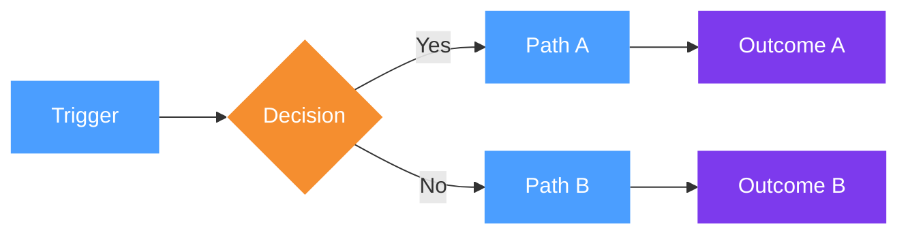
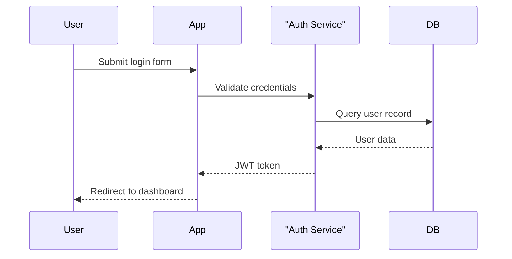
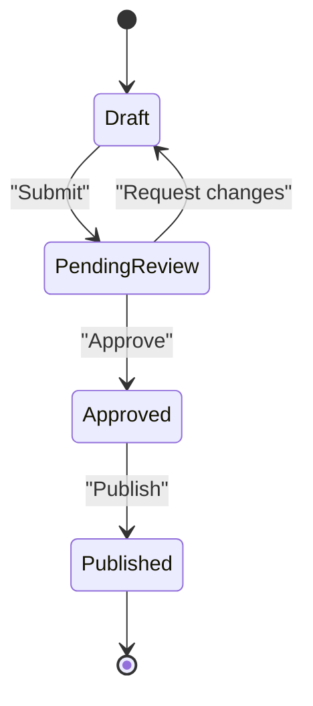
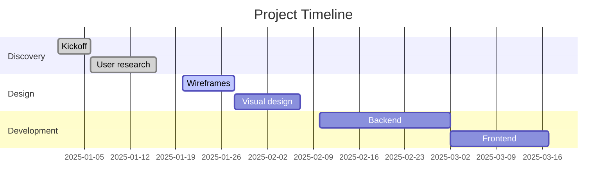

# Visual Patterns for FigJam Diagrams

Patterns for common diagram types. Each pattern shows the coordinate layout
and code structure. Use these as starting points.

---

## Pattern 1 — Horizontal scenario flow (most common)

Used for: process flows, user journeys, scenario options, feature walkthroughs.
The standard for client-facing diagrams.

```
[Bold title]
[Subtitle sentence]

[Actor] → [Step 1] → [Step 2] → [Step 3] → ⬡[State] → [Step 4]
          ↓ annotation      ↓ annotation
        ┌──────────────────────┐   ┌─────────────────────────────┐
        │ ADVANTAGES           │   │ SHORTCOMINGS                │
        │ • ...                │   │ • ...                       │
        └──────────────────────┘   └─────────────────────────────┘
         (green border)              (red border)
```

**Section background:** set via `s.fills` on the Section node itself — never via a child shape.
Pattern: `mkSection(name, x, y, w, h)` calls `s.resize(w,h)` first, then sets `s.fills = white`.

**Coordinates (SY = 195 — title/subtitle use FigJam native sizes 24/16px):**
- Title (bold **24px** / FigJam Medium):  x=64,  y=28
- Subtitle (**16px** / FigJam Small):     x=64,  y=80
- Actor placeholder:    x=64,  y=SY=195  ← aligned with PAD_L (same as title/subtitle)
- Steps:                x = 265 + i×408, y = SY (rectangles) or y = SY-44 (hexagons)
- Annotations (**16px** / FigJam Small):  y = 340
- ADVANTAGES (mkPros):  x=64,  y=410
- SHORTCOMINGS (mkCons): x=660, y=410

**FigJam native text size scale (use for all standalone text — not text inside shapes):**
| Name | Size |
|---|---|
| Small | 16 |
| Medium | 24 |
| Large | 40 |
| Extra large | 64 |
| Huge | 96 |

**After generating:** replace actor placeholder with FigJam library person shape.

**When you have more than 5 steps:**
Reduce GAP to 360, or split into two rows (y=240 and y=540) connected with a vertical arrow.

---

## Pattern 2 — Option comparison (multiple stacked sections)

Used for: comparing 2–4 approaches, each with a flow + pros/cons.
Sections stacked vertically, 220px gap between them.

```javascript
const SEC_H = 1000, SEC_GAP = 220, BASE_X = 0;

// Find the bottom of existing content to avoid overlapping
const BASE_Y = ... // calculate dynamically

const s1 = mkSection("Option 1: ...", BASE_X, BASE_Y);
const s2 = mkSection("Option 2: ...", BASE_X, BASE_Y + SEC_H + SEC_GAP);
const s3 = mkSection("Option 3: ...", BASE_X, BASE_Y + (SEC_H + SEC_GAP) * 2);
```

Each section must start with `mkBackground(sN, sectionWidth, SEC_H)` as the **very first call**
(before mkHeader, mkFlow, etc.). This creates the white card background as the bottom-most layer.
Then use `mkHeader()` for title+subtitle, `mkFlow()` for steps, `mkPros()` and `mkCons()` for pros/cons.

⚠ Do NOT use `section.fills` for the background — FigJam only fills the initial bounding box,
not the expanded area after children are added.

---

## Pattern 3 — Decision tree / branching flow

Used for: conditional processes, "if X then Y else Z" flows.



Decision trees work best with `generate_diagram` (Mermaid) unless rich styling is needed.
For `use_figma`, place decisions using DIAMOND shape type and manually draw branching connectors.

---

## Pattern 4 — Multi-actor sequence diagram

Used for: system interactions, API calls, authentication flows.



Always use `generate_diagram` for sequence diagrams — the Plugin API doesn't handle swimlanes well.

---

## Pattern 5 — Comparison table (no flow, just pros/cons grid)

Used for: feature comparisons, option selection matrices.

Place sections side by side (horizontal) rather than stacking vertically.

```javascript
const SEC_W = 900, SEC_GAP_X = 100;

const s1 = mkSection("Option A", BASE_X, BASE_Y);
const s2 = mkSection("Option B", BASE_X + SEC_W + SEC_GAP_X, BASE_Y);
const s3 = mkSection("Option C", BASE_X + (SEC_W + SEC_GAP_X) * 2, BASE_Y);
```

Each section contains just: title + description + ADVANTAGES/SHORTCOMINGS (no flow).

---

## Pattern 6 — State machine

Used for: order status, approval workflows, lifecycle states.



Always use `generate_diagram` for state diagrams.

---

## Pattern 7 — Project timeline (Gantt)



---

## Colour usage guidelines

**Use colour consistently to communicate meaning:**

| Colour | When to use |
|---|---|
| Blue `#4B9EFF` | Human actions, things a person actively does |
| Purple `#7D3AED` | System events, automated processes, state changes |
| Orange `#F58E2F` | Decisions, warnings, things that need attention |
| Green `#26BA7A` | Completion, success, final positive outcomes |
| Gray `#999999` | Neutral info, actors, supporting elements |

**Don't use colour decoratively** — every colour should mean something.
**Limit to 3 colours per diagram** unless the diagram is large and complex.

---

## Typography

| Context | Size | Style |
|---|---|---|
| Section description | 11 | Regular |
| Step box labels | 11 | Regular (white on coloured bg) |
| Annotations / notes | 10 | Regular |
| ADVANTAGES / SHORTCOMINGS labels | 11 | Regular (the word "ADVANTAGES" is plain, not bold) |
| Actor label | 11 | Regular |

**Writing step labels:**
- Keep under 30 characters (wraps cleanly in a 176px box)
- Use concrete present-tense verbs: "Opens", "Uploads", "Reviews", "Confirms"
- Avoid technical jargon: "System validates format" → "System checks for errors"
- For hexagons (system states), describe the resulting state: "Pricing now active" not "Price updated"

---

## Spacing constants (use_figma)

```javascript
const GAP    = 408;  // center-to-center horizontal distance between steps
const FX     = 265;  // x position of first step (leaves room for actor icon)
const SY     = 195;  // y position of step row (title 24px + subtitle 16px need more room)
const SEC_H  = 620;  // typical section height (full scenario with pros/cons)
const SEC_GAP = 120; // vertical gap between stacked sections
const PAD_L  = 64;   // left padding inside section
const PAD_R  = 200;  // right padding inside section
```

**Section width for n steps:**
```
width = FX + (n-1)*GAP + 176 + PAD_R
      = 265 + (n-1)*408 + 376
```

| Steps | Width |
|---|---|
| 3 | 1457px |
| 4 | 1865px |
| 5 | 2273px |
| 6 | 2681px |
| 7 | 3089px |
